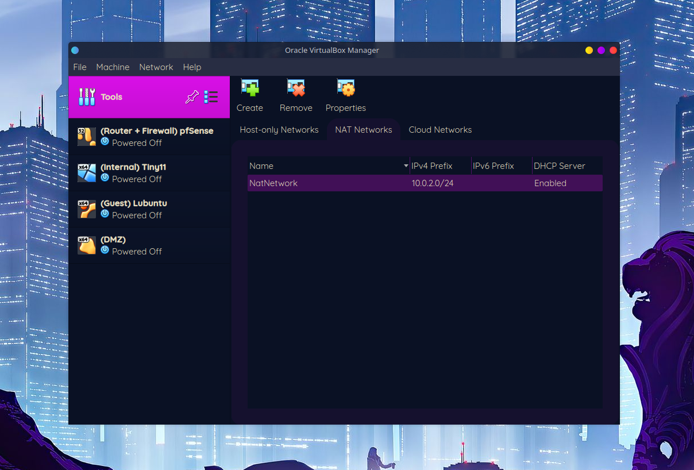
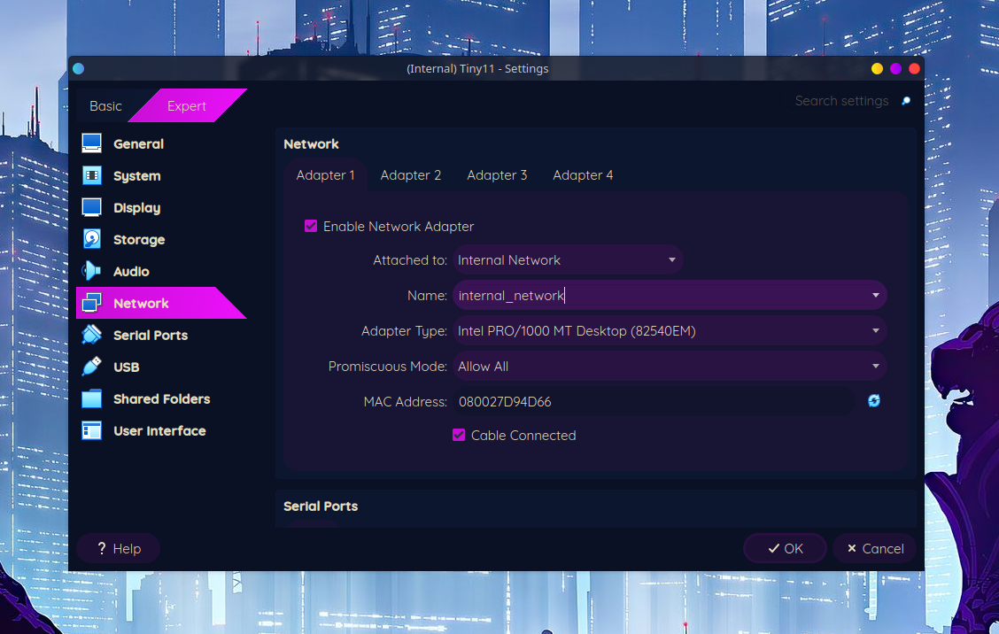

# Home Lab Environment – Corporate Network Simulation

## Status
🟡 **In Progress** – Environment built, configuration ongoing

## Goal
Create a virtual lab environment simulating a small corporate network to gain hands-on experience with network segmentation, routing, security, and domain management.

## Lab Overview
- **PFsense VM** – acts as router/firewall for network segregation  
- **Internal Network** – Windows Tiny11 client for testing AD and domain services  
- **Guest Network** – Lubuntu VM for isolated guest traffic  
- **Metasploitable VM** – simulated vulnerable server for testing and learning security fundamentals  

## Completed Tasks
- Designed and deployed a segmented virtual network with PFsense  
- Installed and configured all virtual machines  
- Verified network connectivity between VMs and network segregation  
- Deployed firewall inbound and outbound rules

## Screenshots & Diagrams
Screenshots and diagrams illustrating network layout and VM setup are stored in the `screenshots` and `diagrams` folders.

## Next Steps
- Install Active Directory Domain Services on Tiny11/Windows Server VM  
- Configure user accounts and groups  
- Apply basic Group Policy Objects  
- Set up logging and monitoring for network traffic  

## What I’ve Learned So Far
- How to design and implement network segmentation and VLAN-style isolation  
- Basics of firewall configuration and routing in PFsense  
- Setting up multiple virtual machines to simulate a corporate network  
- Importance of documenting lab environments before configuration

## Key Screenshot's

### Setting up NAT adapter in virtualbox

### Configuring VM's network adapters

### pfSense installation and configuration
![pfSense install config]
